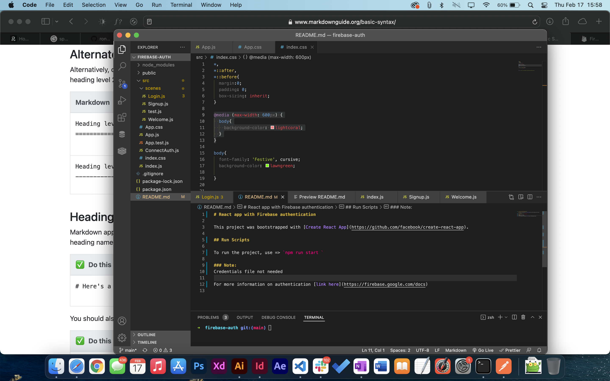

# React app with Firebase authentication

This project was bootstrapped with [Create React App](https://github.com/facebook/create-react-app).

## Run Scripts

To run the project, use => `npm run start `

### Note:
Credentials file not needed

For more information on authentication [link here](https://firebase.google.com/docs)

